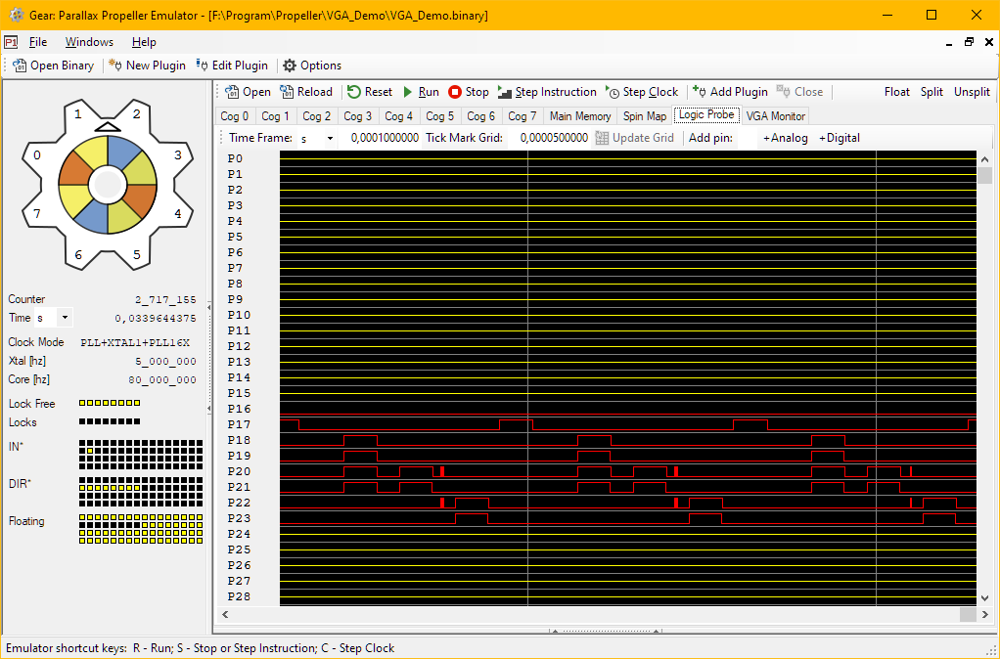

# Gear: Parallax Inc. Propeller P1 emulator

**What is GEAR?** Is a C# program that simulates the inner workings of the Propeller P1 chip.

It is NOT intended to be a replacement for the board, as it is considerably slower (for the sake of accuracy).

Currently it has:

**Propeller Emulation**

* Full support for the current parallax native instruction set, with accurate timing, and HUB 'ring' emulation.
* Stepping per cycle.
* Runtime disassembler for both interpreted code and assembly code.
* Loads the spin IDE's native output (.eeprom and .binary both supported).
* Main memory viewer.
* Interpreted emulation - Emulates all known instructions (see www.sublab.net/spin.html).
* Emulated Frequency generators.
* An internal editor for the plugins, with some support of syntax highlighting.
* Full PLL emulation.
* Video Generator Output, more accurate according Verilog code.

**User Interface**

* A tabbed, visual studio like with multiple emulation instances are allowable in one application.
* The tabbed window support splitting the view, stacking two windows on top of each other, or 'floating' a new window so you can put it where ever you like.
* Support for loading **plugins** (editable C# scripts) to extend the system, and wire up additional emulated components like television, VGA, serial terminal (see [Plugins notes.md](plug-ins/Plugins_notes.md) for the complete list).
* Plugin Editor to personalize or create your own, based on a template.

---
## Last Changes:

*See [changelog.md](changelog.md) for list of changes.*

## Plugins notes

See [Plugins notes](plug-ins/Plugins_notes.md) for brief explanation of each one.

---
## Copyright 2022 - Gear Developers

### Released under the Lesser GNU Public Licence (LGPL).
*See [Licence.txt](Licence.txt) for details.*

### Current Developers:
* @github/davispuh
* @github/gatuno1 - Antonio Sanhueza

### Past Developers:
* mirror (parallax forums)
* benjie (parallax forums) - Ben Levitt
* Robert Vandiver (parallax forums)

### Contributors:
* @github/Sh1nyAnd3o3
* @github/mbaeten
* @github/Memotech-Bill
* @github/jlunder
* Bob Anderson (parallax forums)
* Marc Gebauer (parallax forums)

---
## Third Party Components:
- [Windows Forms Collapsible Splitter Control for .Net](https://www.codeproject.com/Articles/3025/Collapsible-Splitter-control-in-C) 
(c)Copyright 2003 NJF (furty74@yahoo.com). 
Licensed under [The Microsoft Public License (Ms-PL)](https://opensource.org/licenses/ms-pl.html)

- Icons from and derived of [Visual Studio 2019 Image Library](https://docs.microsoft.com/en-us/visualstudio/designers/the-visual-studio-image-library?view=vs-2019). 
(c)Copyright 2019 Microsoft Corporation. All rights reserved. 
*See `Visual Studio 2019 Image Library EULA.rtf` for licence details.*

